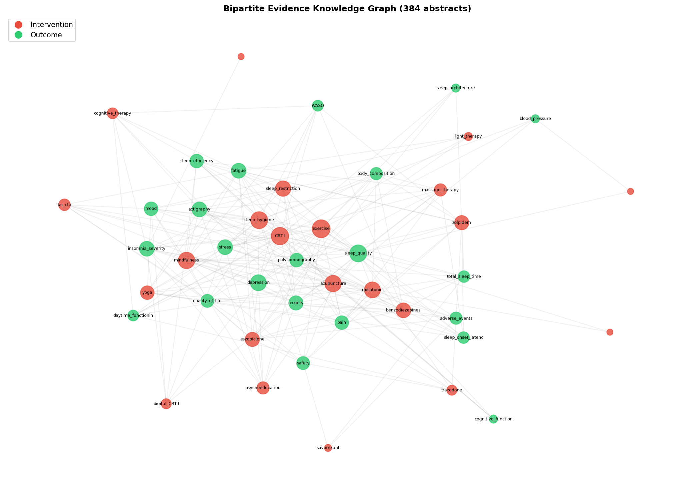

# EvidenceGraphLP

**Prospective Identification of Clinical Evidence Gaps Using Temporal Link Prediction on NLP-Constructed Bipartite Knowledge Graphs**

[](LICENSE)
[](https://www.python.org/)
[](https://github.com/Franck-Dernoncourt/pubmed-rct)

> **Paper:** Submitted to the *Journal of Biomedical Informatics* (Elsevier, Q1)

---

## Overview

Systematic reviews can tell us what clinical evidence exists — they cannot tell us what is missing. **EvidenceGraphLP** formalises evidence gap identification as temporal link prediction on bipartite knowledge graphs, where intervention nodes connect to outcome nodes through edges representing completed clinical trials.



### Key Results

| Metric | Value |
|---|---|
| Temporal AUC-ROC (Gradient Boosting) | **0.932** |
| Improvement over naïve degree baseline | **+25.9 pp** |
| Bipartite topology features alone | **0.876 AUC** |
| Degree-only features | 0.622 AUC |
| Standard heuristics (Jaccard, CN, AA) | 0.500 (chance) |

**Central insight:** Standard neighbourhood-based link prediction heuristics are structurally uninformative on bipartite evidence graphs. One-mode projection features capture evidence accumulation patterns that drive prediction.

**Important distinction:** The model predicts *research trajectory* (what is likely to be studied) rather than *clinical importance* (what should be studied).

---

## Repository Structure

```
EvidenceGraphLP/
├── data/
│   └── sleep_corpus.json            # 384 RCT abstracts with PMID-derived years
├── src/
│   ├── fetch_pubmed.py              # Fetch fresh abstracts from PubMed API
│   ├── pico_extraction.py           # Hybrid NLP extraction + KG construction
│   └── link_prediction.py           # Temporal link prediction (main pipeline)
├── results/
│   ├── knowledge_graph.graphml      # Bipartite evidence graph
│   ├── pico_triples.csv             # Extracted intervention–outcome triples
│   ├── evidence_matrix.csv          # Intervention × outcome co-occurrence
│   ├── gap_predictions.csv          # Ranked evidence gap predictions
│   ├── extraction_results.json      # Per-abstract PICO extraction
│   └── experiment_summary.json      # Model performance summary
├── figures/
│   ├── fig1_model_comparison.png    # AUC-ROC + ablation
│   ├── fig2_feature_importance.png  # Feature importance
│   ├── fig3_gap_predictions.png     # Gap fill heatmap
│   └── fig4_knowledge_graph.png     # Knowledge graph visualisation
├── README.md
├── requirements.txt
├── LICENSE
└── .gitignore
```

---

## Reproducing the Results

### 1. Clone and install

```bash
git clone https://github.com/Rifa-111/EvidenceGraphLP.git
cd EvidenceGraphLP
pip install -r requirements.txt
python -m spacy download en_core_web_sm
```

### 2. Run the pipeline

```bash
cd src
python link_prediction.py
```

This reproduces Tables 2–4 and Figures 1–3 from the paper using the included corpus (`data/sleep_corpus.json`). All outputs are written to `results/` and `figures/`.

### 3. (Optional) Fetch fresh abstracts from PubMed

```bash
cd src
python fetch_pubmed.py
python link_prediction.py
```

Requires [Biopython](https://biopython.org/) and internet access.

---

## Pipeline Architecture

```
PubMed RCT abstracts
        │
        ▼
Hybrid NLP extraction (dictionary + spaCy dependency parsing)
        │
        ▼
Bipartite knowledge graph (interventions ↔ outcomes)
        │
        ▼
Temporal split (train ≤2014, test 2015–2017)
        │
        ▼
Feature engineering (9 predictors: 6 degree-derived, 3 bipartite topology)
        │
        ▼
Supervised link prediction + bootstrap 95% CIs
        │
        ▼
Ranked evidence gap predictions + negative sampling sensitivity
```

### Features (9 total)

| Category | Features | Count |
|---|---|---|
| Degree-derived | deg_u, deg_v, deg_product, deg_sum, deg_diff, deg_ratio | 6 |
| Bipartite topology | shared_intermediate_paths, projected_deg_u, projected_deg_v | 3 |

**Excluded:** Node-type indicators (trivial), preferential attachment (algebraically redundant with degree product), weighted_paths (identically zero on bipartite graphs).

---

## Caveats

- The model predicts **research trajectory**, not **clinical importance**
- The NLP extraction has **not been validated** against manual annotations
- Publication years are approximated from PMID assignment order
- The temporal test set contains 60 positive samples
- Evaluated on a single clinical domain (sleep disorders)

---

## Data Source

Corpus derived from the [PubMed 20k RCT dataset](https://github.com/Franck-Dernoncourt/pubmed-rct) (Dernoncourt & Lee, IJCNLP 2017), filtered for sleep disorder interventions. All abstracts are genuine PubMed records.

---

## Citation

```bibtex
@article{ferzana2026evidencegraphlp,
  title={Prospective identification of clinical evidence gaps using temporal 
         link prediction on {NLP}-constructed bipartite knowledge graphs},
  author={Ferzana, Rifa},
  journal={Journal of Biomedical Informatics},
  year={2026},
  note={Under review}
}
```

---

## Licence

MIT — see [LICENSE](LICENSE) for details.
